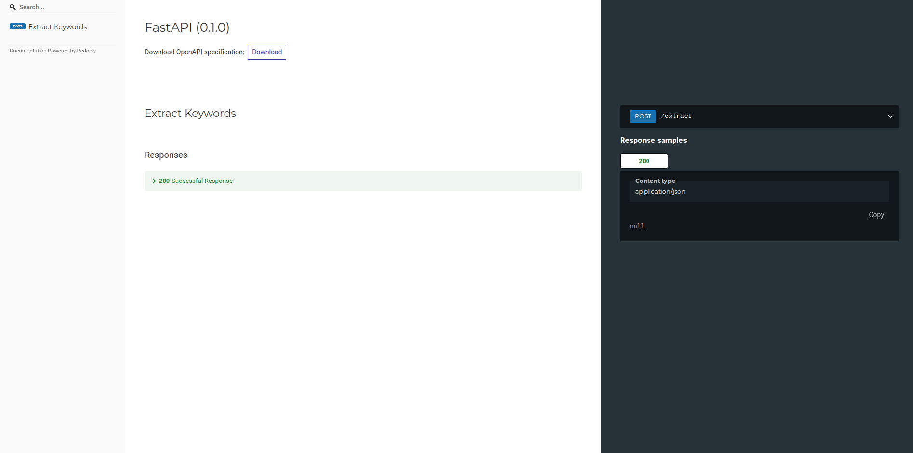

# Keyword Extraction Service from Text 

## What is it?
A microservice for extracting keywords from text by <a href="https://github.com/LIAAD/yake">YAKE</a>. Accessed via an API.

## Documentation


POST request to extract endpoint:
```json
{
    "text": ["This is a test text", "This is another test text"]
}

```
succuss output (200):
```json
{
    "keywords": ["word", "word"]
}
```

## Run
Two ways to run the api:

bash run.sh:
```sh
    $ python -m venv .venv
    $ source .venv/bin/activate
    $ pip install -r requirements.txt
    $ uvicorn app:app --host 127.0.0.1 --port 9004 --reload
```
Or

docker container:
```docker
    $ docker build . -t keyword-extractor-service
    $ docker run -p 9004:9004 -d --name keyword-extractor-service keyword-extractor-service
``` 

